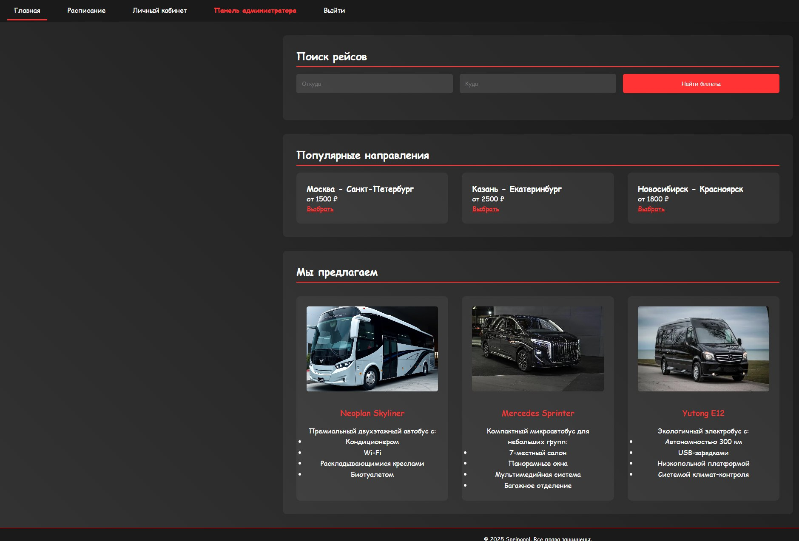
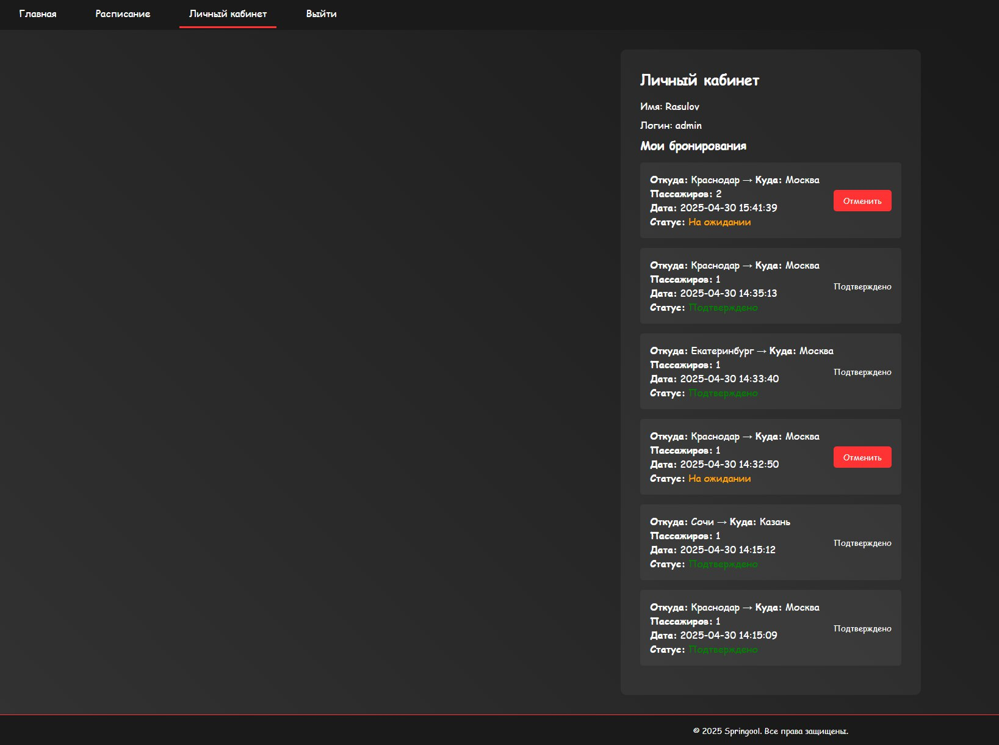
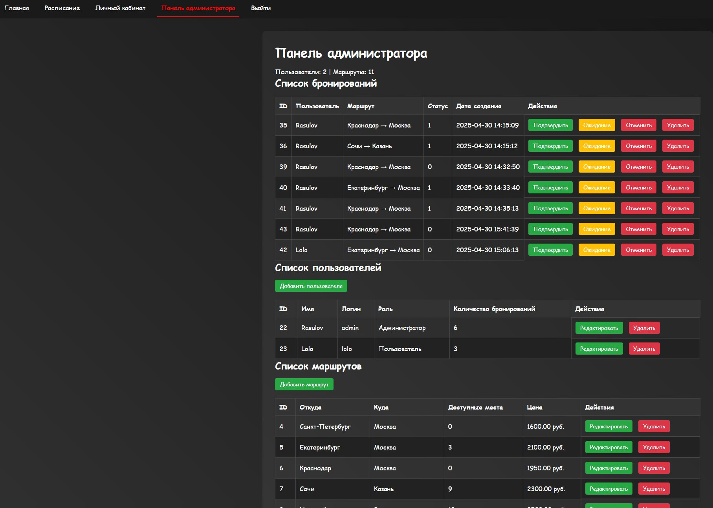
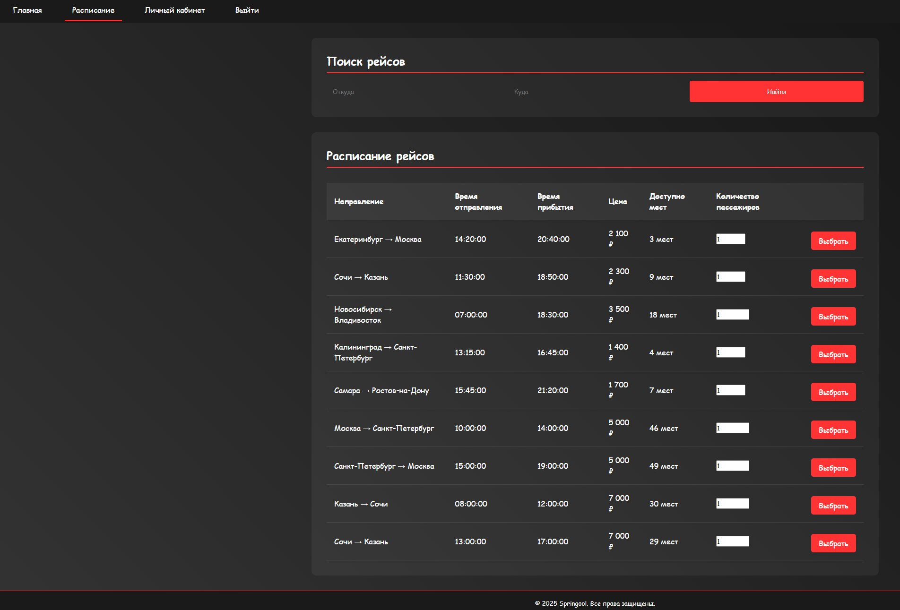

# 🚌 Springool — Secure Bus Booking System

> An educational PHP/MySQL web application for bus ticket booking with user roles, route management, and admin panel. Built with security-first principles: protected against SQL injection, XSS, and password leaks.

[](https://owasp.org)
[](https://www.php.net/)
[](https://www.mysql.com/)

---

## 🎯 Purpose
This project demonstrates secure web development practices in PHP:
- ✅ **SQL injection prevention** via PDO prepared statements  
- ✅ **XSS protection** using `htmlspecialchars()`  
- ✅ **Secure password hashing** with `password_hash()`  
- ✅ **Role-based access control** (user / admin)  
- ✅ **Transaction-safe bookings**  
- ⚠️ CSRF protection is **not implemented** (educational scope)

> 🔒 **Not for production use** — built for learning secure coding.

---

## 🛠️ Tech Stack
- **Backend**: PHP 8+, PDO, `vlucas/phpdotenv`
- **Frontend**: HTML5, CSS3, vanilla JavaScript
- **Database**: MySQL 8+
- **Security**: OWASP-aligned practices

---

## 🖼️ Screenshots
<div align="center">
  
  
  
  
</div>

---

## 📦 Local Setup

### Prerequisites
- PHP 8.0+
- MySQL
- [Composer](https://getcomposer.org/)

### Steps
1. Clone the repository:
   ```bash
   git clone https://github.com/Apachiend/springool-transport.git
   cd springool-transport